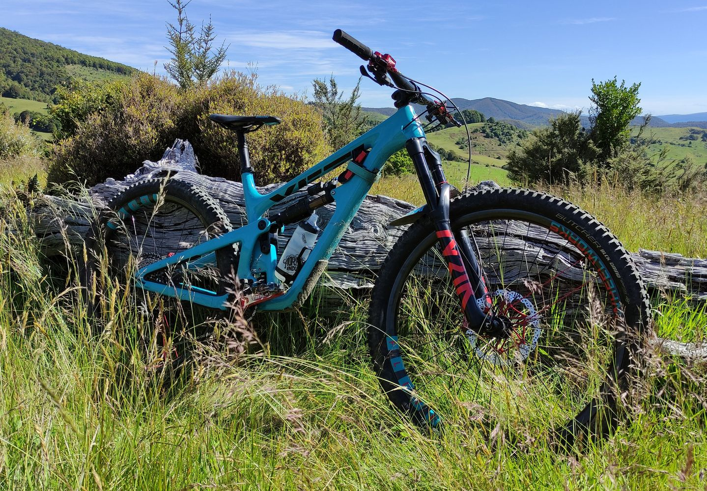

# Bike Maintenance Tracker

by Steve Copley

---

## Project Description

This is project for the design and creation of a system that allows someone to track maintenance jobs for their bikes.

- Bikes can be added to the system
- Maintenance tasks can be defined for the bikes and added to the system
- Tasks can be one-offs or can be repeating ones
- Tasks that have not yet been completed are clearly listed
- Tasks can be marked as completed
- When a repeating task is marked as complete, it will be marked as incomplete again after a set amount of time

---

## Project Links

- [GitHub repo for the project](https://github.com/waimea-cpy/300dtd-bike-maintenance-system)
- [Live web app](https://...)

---

## Project Files

- Program source code can be found in the [app](app/) folder
- Project documentation is in the [docs](docs/) folder, including:
   - [Project requirements](docs/0-requirements.md)
   - Development sprints:
      - [Sprint 1](docs/1-sprint-1-prototype.md) - Development of a prototype
      - [Sprint 2](docs/2-sprint-2-mvp.md) - Development of a minimum viable product (MVP)
      - [Sprint 3](docs/3-sprint-3-refinement.md) - Final refinements
   - [Final review](docs/4-review.md)
   - [Setup guide](docs/setup.md) - Project and hosting setup

---

## Project Details

This is a digital media and database project for **NCEA Level 3**, assessed against standards [91902](docs/as91902.pdf) and [91903](docs/as91903.pdf).

The project is a web app that uses [Flask](https://flask.palletsprojects.com) for the server back-end, connecting to a SQLite database. The final deployment of the app is on [Render](https://render.com/), with the database hosted at [Turso](https://turso.tech/).

The app uses [Jinja2](https://jinja.palletsprojects.com/templates/) templating for structuring pages and data, and [PicoCSS](https://picocss.com/) as the starting point for styling the web front-end.

The project demonstrates a number of **complex database techniques**:
- Structuring the data using multiple tables
- Creating queries which insert, update or delete to modify data
- Creating customised data displays from multiple tables (e.g. web pages)
- Dynamically linking data between the database and a front-end display
- Applying data access permissions as appropriate to the outcome

The project demonstrates a number of **complex digital media (web) techniques**:
- Using non-core functionality
- Using sophisticated digital effects
- Applying industry standards or guidelines
- Using responsive design for use on multiple devices
- The integration of original media assets
- Using dynamic data handling and interactivity
- Automation through scripts

** EDIT THESE LISTS ABOVE TO MATCH YOUR PROJECT**

