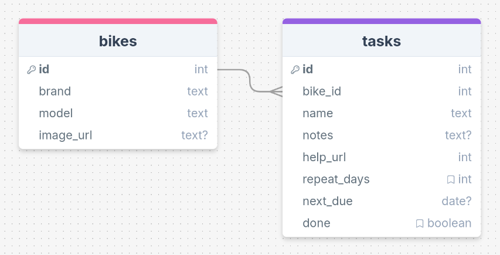

# Sprint 1 - A Working UI Prototype

## Sprint Goals

Develop a prototype that simulates the key functionality of the system, then test and refine it so that it can serve as the model for the next phase of development in Sprint 2.

[Figma](https://www.figma.com/) is used to develop the prototype.

---

## Initial Database Design

This is the initial design for the database, linking tasks to specific bikes. Tasks and bikes can have various bits of data attached. Tasks have a field that allows a number of days to wait before the task repeats (0 days means a non-repeating task):

After talking with some potential end-users, we realised that the repeating tasks won't work unless a date field exists too - this will be filled in when a repeating task is completed, adding the repeating days to the current date to calculate the next due date. When this date is reached, the task will be marked undone again. Also, we added a help URL field to allow for links to websites / videos with help for the specific task:

### Required Data Input

The end-user will supply information about bikes and related tasks. Some of the tasks will be one-offs whilst others will be repeating tasks that need to be completed on a schedule (e.g. every 14 days).

Data will be input via forms and submitted to the database.

Tasks that have been completed can be marked 'done' and the database will be updated.

### Required Data Output

The system will display output data in a number of ways:
- A list of bikes
- Lists of tasks associated with each bike
- Details of tasks (e.g. notes, links to help videos, etc.)

### Required Data Processing

Some processing is required to obtain the required output data from the database:

- Tasks must be filtered by bike so that only tasks associated with each bike are shown

- Repeating tasks must be evaluated to see if they are due again. This involved looking at the date they were first input / last completed, adding on the repeating day count (e.g. 14) and then seeing if this date is today or in the past. If so, the task is marked as 'not done' so that it again is shown to the user.

---

## UI 'Flow'

The first stage of prototyping was to explore how the UI might 'flow' between states, based on the required functionality.

This Figma demo shows the initial design for the UI 'flow':

<iframe style="border: 1px solid rgba(0, 0, 0, 0.1);" width="350" height="450" src="https://embed.figma.com/proto/Wk63L9vS2AAiRFURjktUI9/Bike-Maintenance-Flow-V1?node-id=2-2&p=f&scaling=min-zoom&content-scaling=fixed&page-id=0%3A1&starting-point-node-id=2%3A2&embed-host=share" allowfullscreen></iframe>

### Testing

I gave this demo to some potential end-users to see if they had any comments / feedback. These issues were raised:

> There is no way to get back from the Bike Details screen to the home screen so that the user can swap to a different bike.

> It would be good to see a list of all tasks for all bikes in one place

### Changes / Improvements

I updated the UI flow diagram:
- Added a back button from the Bike Details screen to go back to the Home screen
- Added a link from the Home screen to an All Tasks Screen

Here is the updated UI flow:

<iframe style="border: 1px solid rgba(0, 0, 0, 0.1);" width="350" height="450" src="https://embed.figma.com/proto/TxofPzj9xSrFjJa7OlaFXy/Bike-Maintenance-Flow-V2?node-id=2-2&scaling=min-zoom&content-scaling=fixed&page-id=0%3A1&starting-point-node-id=2%3A2&embed-host=share" allowfullscreen></iframe>

### Further Testing

Sharing this again with end-users, they seemed happy with the overall flow. We agreed that marking a task done should take you back to the specific bike screen, even if you came from the All Tasks screen.

The end-users were happy to move forward with the design.

---

## Initial UI Prototype

The next stage of prototyping was to develop the layout for each screen of the UI.

This Figma demo shows the initial layout design for the UI:

<iframe style="border: 1px solid rgba(0, 0, 0, 0.1);" width="400" height="650" src="https://embed.figma.com/proto/brbFa7ZVWSXf18Jrab9XYH/Bike-Maintenance-Design-V1?node-id=1-23&p=f&scaling=scale-down&content-scaling=fixed&page-id=0%3A1&starting-point-node-id=1%3A2&embed-host=share" allowfullscreen></iframe>

### Testing

I showed this mock-up of the system UI to a number of potential end-users and gave them a chance to interact with it.

I asked them to comment on the usability of the system (bearing in mind Nielsen's Usability Heuristics) and also the system functionality. I asked them to ignore colour / font choice for now.

This is the feedback I obtained:

> The system works well and is pretty simple to use. I didn't need any help to work out how to use it.

> I like the layout of each screen - it is simple and clear.

> I would like to see a count of tasks for each bike on the home screen so that you can see which bikes need work doing.

> Tasks should have a priority so that I can set some as important, and others not. Then the most important ones could be shown at the top of the task list

### Changes / Improvements

Based on the above feedback, I updated the UI design with some changes:

- Task count for each bike
- Task priority (this needed a database update too)

This is the updated UI design:

<iframe style="border: 1px solid rgba(0, 0, 0, 0.1);" width="400" height="650" src="https://embed.figma.com/proto/kRrbSRRIjFTfhtQneEzqoI/Bike-Maintenance-Design-V2?node-id=1-2&p=f&scaling=scale-down&content-scaling=fixed&page-id=0%3A1&starting-point-node-id=1%3A2&embed-host=share" allowfullscreen></iframe>

And this is the updated database with an 'important' field added to the tasks table:

### Further Testing

Showed this updated version to the end-users and got the following feedback:

> The task count really helps you to see what needs doing, right form the home page

> It might be nicer to use a star symbol for high-priority tasks, but otherwise I like the way some tasks can be marked as extra important.

The users were happy to continue with this design.

---

## Refined UI Prototype

Having established the layout of the UI screens, the prototype was refined visually, in terms of colour, fonts, etc.

### Colours

I explored some colour palettes that I thought would work well. I used the Realtime Colors website:

- [Palette 1 Link](https://www.realtimecolors.com/?colors=080c0a-f9fbfb-71a290-a9bdc7-93a3b8)
- [Palette 2 Link](https://www.realtimecolors.com/?colors=101314-fafcfc-4ca9bf-8cd6e7-59d4f1)

### Testing

Both of these palettes scored well on contrast, so work in terms of accessibility.

I showed the palettes to some end-users to see if they had a preference:

- 3 users preferred Palette 1
- 5 users preferred Palette 2
- 2 users liked both

So, based on this, I'll go ahead with the second palette and apply it to the UI design

### UI with Colour

This Figma demo shows the UI with refinements applied:

<iframe style="border: 1px solid rgba(0, 0, 0, 0.1);" width="400" height="650" src="https://embed.figma.com/proto/QSMmVlsUacZJPo1EwyiyrK/Bike-Maintenance-Design-V3?node-id=1-2&p=f&scaling=scale-down&content-scaling=fixed&page-id=0%3A1&starting-point-node-id=1%3A2&embed-host=share" allowfullscreen></iframe>

### Testing

The end-users were shown the UI design with the colour palette applied and asked to evaluate it:

> The colours are clean and simple. They don't distract. Everything is easy to see and read.

> I like the blues. They make the app look clean and modern.

> I like the blue colours, but I would like a dark mode. The white is too bright.

### Changes / Improvements

Based on the feedback above, I produced a second version with a dark mode, using the same blue palette.

I will try to make this a user-choice when using the web app.

<iframe style="border: 1px solid rgba(0, 0, 0, 0.1);" width="400" height="650" src="https://embed.figma.com/proto/wsUPJ5yFVA7IkwHIinYk04/Bike-Maintenance-Design-V4?node-id=1-2&p=f&scaling=scale-down&content-scaling=fixed&page-id=0%3A1&starting-point-node-id=1%3A2&embed-host=share" allowfullscreen></iframe>

### Testing

The user who mentioned the dark mode liked the updated design.

> The dark mode is a good improvement - Easier on my eyes!

I think that the design does not need further refinement at this point.

---

## Sprint Review

Overall, I think that this sprint has been really successful. I have a clear idea of what the system should do, what it should look like and my end-users are pleased with the progress so far.

I feel that I am now ready to move on to creating the web app.

